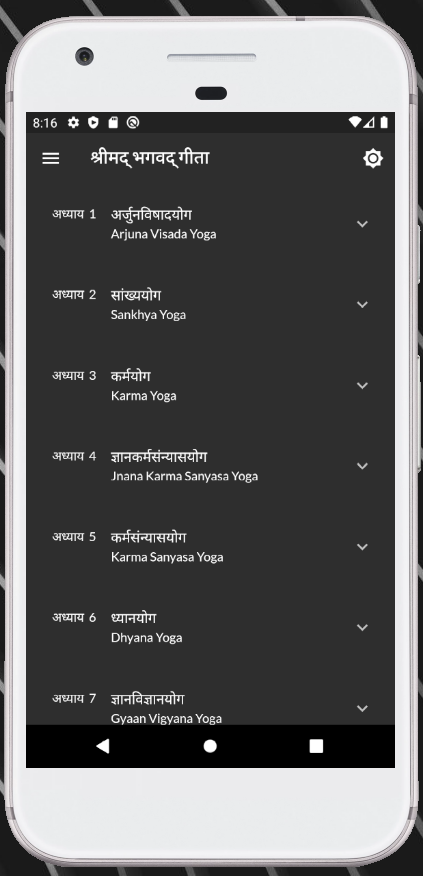
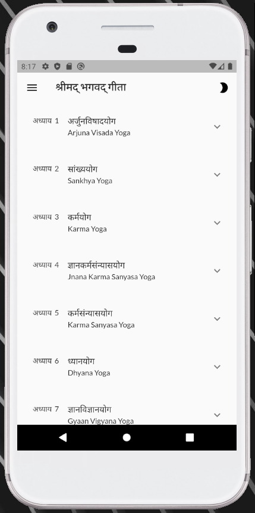
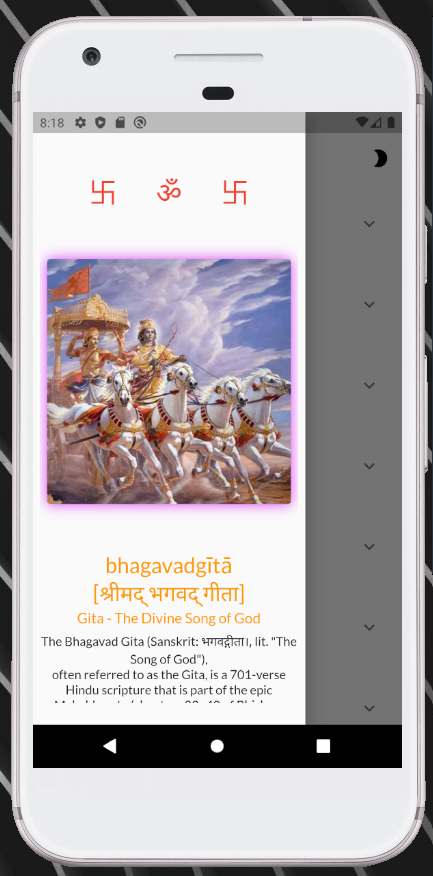
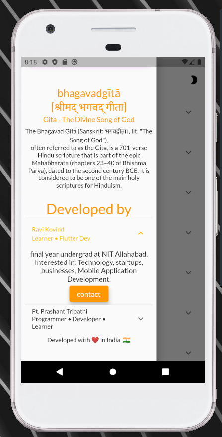
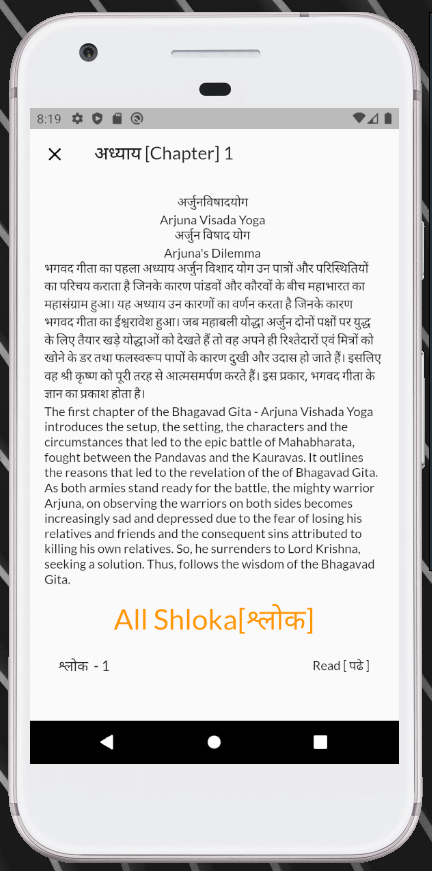
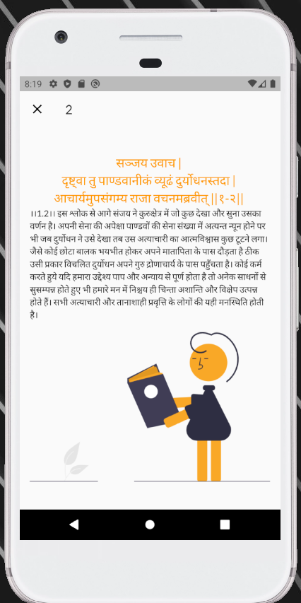

# Gita
Bhagavad Gita flutter app.
- [Download App - Playstore](https://play.google.com/store/apps/details?id=com.gita)
- [Web Application](https://ravikovind.github.io/bhagavad_gita_webapp/)

# About

Bhagavad Gita app using flutter & Bhagavad-Gita-API is A lightweight Node.js based Bhagavad Gita API [An open source rest api on indian Vedic Scripture Shrimad Bhagavad Gita].

# Learning
- large JSON Data handling
- API example

# screenshot

     

# 💻 Built with
- [Flutter](https://flutter.dev/)
- [Bhagavad-Gita-API](https://github.com/vedicscriptures/bhagavad-gita-api)

# Collaboration
Special Thanks to Pt. Prashant Tripathi for Bhagavad-Gita-Api.
- [contact](https://github.com/PtPrashantTripathi)

